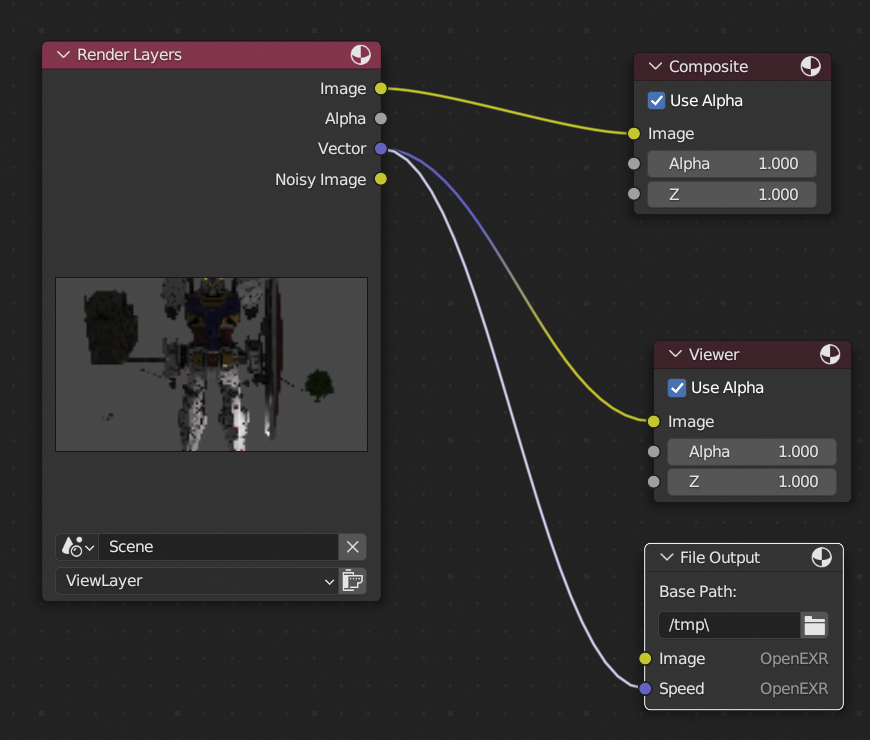
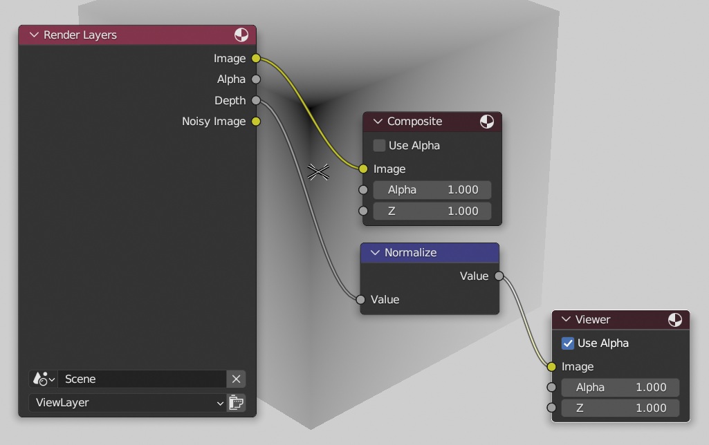

# BAT Tests

## Tests for optical flow

### Blender Compositing layer setup (optical flow)

### Blender Compositing layer setup (depth map normalization)

source: http://www.tobias-weis.de/groundtruth-data-for-computer-vision-with-blender/
